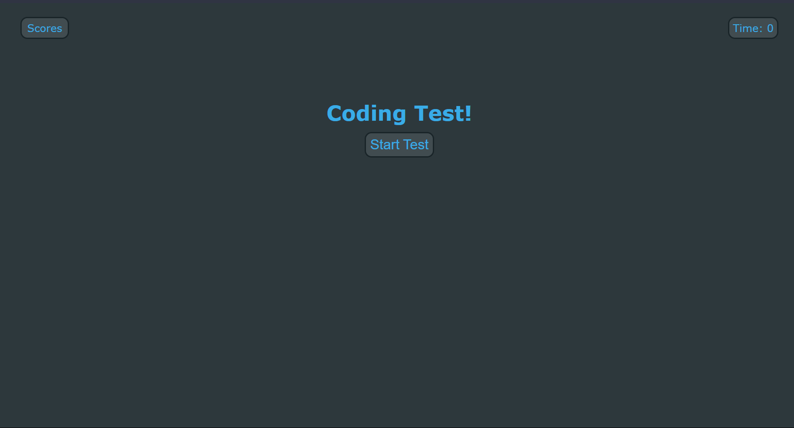

# coding-assessment

## Description
This is a quiz for entry level web developers to test their knowledge of coding.

## Usage
Click the start button to begin the test, click the bubbles next to the questions to select your answer, click submit to submit your answer and move on to the next question. If you get a question wrong you lose 10 seconds. When you've answered all 10 questions your score will show on the screen and you can enter your initials to save your score to local storage. Hover over the scores icon to see past scores.

https://elijahafrancis.github.io/coding-assessment/